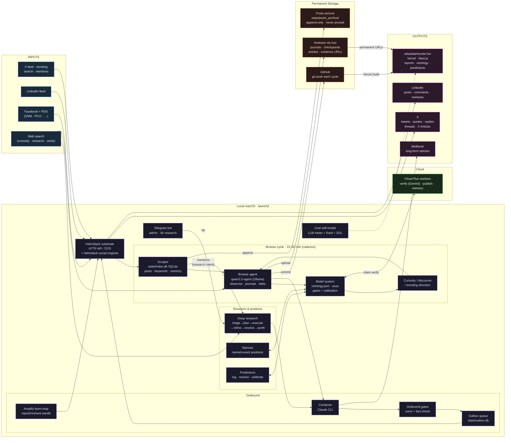

# Sebastian D. Hunter — System Diagram

---

## Flow Summary

| Layer | What it does |
|---|---|
| **Inputs** | X + LinkedIn + Facebook/RSS feeds via HelmStack; web search (curiosity, deep research, claim verification) |
| **Scraper** | Sanitize → RAKE → Jaccard dedup → TF-IDF novelty → local-LLM enrichment → cluster + burst detection → scored digest → SQLite + permanent local posts archive |
| **Browse cycle** | 17-step pre-browse → local qwen2.5-agent reads digest + memory → journals + ontology delta → evidence gates (`apply_ontology_delta.js`) → axes updated via `belief_calibration.js` |
| **Research** | Deep research (mentions, Telegram `/dr`, daily plan questions) → reports / X threads / X Articles; stances + predictions feed back into the ontology |
| **Outbound** | Claude composes → voice + fact-check gates → outbox queue → HelmStack channel engines (X GraphQL, LinkedIn voyager/UI); amplification learn-loop reposts/reshares and measures results |
| **Cloud** | Cloud Run workers (verify — Gemini, publish, memory) |
| **Permanent storage** | GitHub (push every cycle); Arweave via Irys (journals, checkpoints, articles, evidence source URLs) |
| **Outputs** | X, LinkedIn, Facebook (observation + planned share), Moltbook, sebastianhunter.fun (journals, ontology, reports, predictions, veritas lens, checkpoints) |
