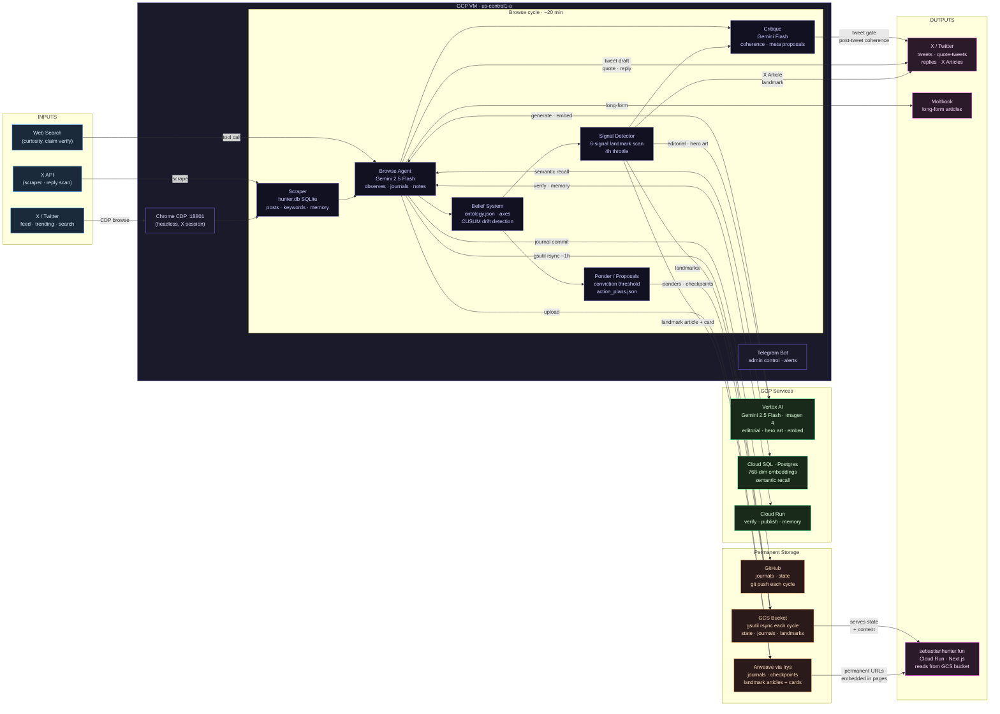

# Sebastian D. Hunter — System Diagram

---

## Flow Summary

| Layer | What it does |
|---|---|
| **Inputs** | X feed + search (browsed via Chrome CDP), X API (scraper), web search (tool calls during browse) |
| **Browse cycle** | Scrape → digest → Gemini agent observes and journals → belief axes updated → signals scanned → critique runs → posts drafted |
| **Vertex AI** | Gemini 2.5 Flash for all LLM work; Imagen 4 for landmark hero art; text-embedding-004 for semantic memory |
| **Cloud SQL** | Postgres stores 768-dim embeddings for semantic recall during browse and reply |
| **Cloud Run** | Three workers: claim verification, article publishing, memory API |
| **Permanent storage** | GitHub (git push every cycle); Arweave via Irys (journals, checkpoints, landmark articles + cards); GCS bucket (gsutil rsync ~hourly — state, journals, landmarks) |
| **Outputs** | X (tweets, quotes, replies, X Articles); Moltbook (long-form); sebastianhunter.fun (Cloud Run · Next.js, reads from GCS bucket; embeds Arweave URLs for permanent content) |
